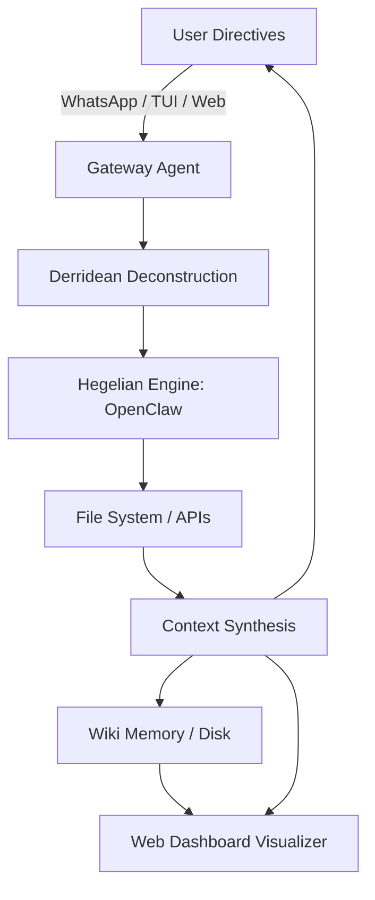

# BABYLON.IA: Autonomous Multi-Channel Agent (Geist Architecture)

```text
                                       .::::.
                                      /++++++\
                                     /++++++++\
                                    |==========|
                                   /++++++++++++\
                   ._.            /++++++++++++++\             ._.
                   | |           |================|            | |
                 _ | | _        /++++++++++++++++++\         _ | | _
                / \| |/ \      /++++++++++++++++++++\       / \| |/ \
                |=======|     |======================|      |=======|
               /+++++++++\   /++++++++++++++++++++++++\    /+++++++++\
               |=========|  /++++++++++++++++++++++++++\   |=========|
              /+++++++++++\|============================| /+++++++++++\
              |===========/++++++++++++++++++++++++++++++\|===========|
             /+++++++++++/++++++++++++++++++++++++++++++++\++++++++++++\
             |==========|==================================|===========|
            /++++++++++/++++++++++++++++++++++++++++++++++++\+++++++++++\
    .       |=========/++++++++++++++++++++++++++++++++++++++\==========|      .
   / \     /+++++++++|========================================|++++++++++\    / \
  /   \    |========/++++++++++++++++++++++++++++++++++++++++++\=========|   /   \
 /_____\  /++++++++/++++++++++++++++++++++++++++++++++++++++++++\+++++++++\ /_____\
 |=====|  |=======|==============================================|========| |=====|
/+++++++\/+++++++/++++++++++++++++++++++++++++++++++++++++++++++++\++++++++\/+++++++\
|=======||======/++++++++++++++++++++++++++++++++++++++++++++++++++\=======||=======|
|       ||     |====================================================|      ||       |
|_______||____/++++++++++++++++++++++++++++++++++++++++++++++++++++++\_____||_______|
```

**Juan Esteban Gómez Bernal**

> *"BABYLON.IA is not just a tool; it is the code materialization of the Escohotado-Kojève Synthesis deployed in an environment constrained by Asimov and parsed through Derrida."*

---

## 📌 Table of Contents

1. [Abstract](#abstract)
2. [The Hegel-Asimov-Kojève-Derrida Environment](#the-hegel-asimov-kojève-derrida-environment)
3. [System Architecture & Visualizations](#system-architecture--visualizations)
4. [Advancements & Model Improvements (Wiki Log)](#advancements--model-improvements-wiki-log)
5. [Implementation & Installation](#implementation--installation)
6. [Usage Protocol](#usage-protocol)
7. [Conclusions of the Investigation](#conclusions-of-the-investigation)

---

## 1. Abstract

**BABYLON.IA** is a decentralized autonomous agent that communicates through WhatsApp, Telegram, X (Twitter), and a local Web Dashboard. It uses a personal mobile device or web interface as a bridge to orchestrate local tasks and B2B workflows on a personal computer. To achieve this without incurring abusive API costs, the repository implements an **Auth-Bridge** that reads and utilizes the `OAuth 2.0` token generated by the local Gemini Command Line Interface (CLI).

This repository functions as a living wiki, tracing the evolution of an AI agent as it iterates through increasingly complex philosophical and systemic frameworks. It has evolved into an advanced environment capable of native text analysis, interactive web visualizations, and managing local wiki trees for systematic memory retention.

---

## 2. The Hegel-Asimov-Kojève-Derrida Environment

The theoretical underpinning of BABYLON.IA goes beyond standard software architecture. It models its cognition and constraints after a synthesized framework of four major philosophical/literary paradigms. This "HAKD" environment ensures the agent operates not merely as a script, but as a dialectical entity.

### 2.1 Hegel: The Dialectical Engine (Geist)
At the core of the backend is the **OpenClaw** engine, which operates strictly on a Hegelian dialectical loop:
* **Thesis (Assimilation):** The agent absorbs the raw user directive and the immediate state of the local context.
* **Antithesis (Execution & Conflict):** The agent attempts to map the directive onto reality (the file system, the Sandbox), encountering constraints, errors, and contradictions.
* **Synthesis (Resolution):** The agent modifies its approach or generates a new state, producing the final response or executed action.

### 2.2 Asimov: Axiomatic Constraints
While Hegel provides the engine of motion, Asimov provides the boundaries. The agent operates under strict programmable constraints (analogous to the Three Laws):
1. **Preservation of the Host:** The agent operates within a defined Sandbox. It cannot execute destructive commands outside its designated workspace.
2. **Obedience to the Whitelist:** Commands are strictly gated by the `AUTHORIZED_NUMBERS` protocol.
3. **Self-Preservation:** The agent utilizes non-blocking I/O and fallback local models (Ollama) to prevent system crashes or API blockages.

### 2.3 Kojève & Escohotado: The Master-Slave Automation
Drawing from Alexandre Kojève’s reading of Hegel, BABYLON.IA models the Master-Slave dialectic in the realm of automation. The User (Master) issues directives but remains alienated from the physical labor of computation. The Agent (Slave) interacts with the material world (the codebase, the OS) and, through its labor, achieves a higher synthesis of knowledge.

### 2.4 Derrida: Deconstructive Task Parsing
Before the dialectical loop begins, user directives are subjected to a Derridean deconstruction. Language models are fundamentally engines of text. The agent deconstructs the user's `!geist` commands, stripping away linguistic ambiguities, isolating the core semantic intent, and translating it into actionable binary or script execution paths.

---

## 3. System Architecture & Visualizations

The core architecture of BABYLON.IA consists of deeply integrated, multi-platform components that provide unparalleled visibility into the agent's internal thought processes.



### 3.1 Multi-Platform Integrations
The agent utilizes `whatsapp-web.js` for WhatsApp, `telegraf` for Telegram, and `twitter-api-v2` for X. It also includes a local **Web Dashboard** with real-time WebSockets (`socket.io`). This allows the system to listen for specific commands sent from any chat, triggering the agent's internal processes.

### 3.2 Gemini OAuth Bridge
To bypass expensive API usage fees, BABYLON.IA implements an Auth-Bridge. It reads the local `~/.gemini/oauth_creds.json` file, created by the Gemini CLI, to authenticate and route analytical tasks to the Gemini LLM. It also supports standard API Keys and local models via Ollama.

### 3.3 Dynamic Dashboard & Telemetry
The Dashboard has been evolved to provide real-time feedback on the `Geist` reasoning loops. It renders:
- **Flujo de Razonamiento:** Live logs of the Thesis-Antithesis-Synthesis cycles.
- **Configuración (Ops):** Model switching on-the-fly (e.g., from Gemini to Ollama).
- **System Logs:** Error tracing and hardware interactions.

### 3.4 Wiki Workspace File Tree (New!)
A brand new tab in the Dashboard allows users to **visualize and interact with the agent's internal memory**. 
* The interface features a dual-pane setup: a **File Explorer Tree** on the left and a **Markdown Editor** on the right.
* Users can view the `.md` wiki files generated during investigations, create new concepts on the fly, and edit the base knowledge (`AGENTS.md`).
* This establishes a bi-directional educational environment: the Agent learns from the user's edits, and the user oversees the structural knowledge maps built by the AI.

---

## 4. Advancements & Model Improvements (Wiki Log)

*Similar to Andrej Karpathy's open-source logs, this section documents the iterative improvements of the model within the HAKD environment.*

### 🟣 Version 2.3: Dashboard Visualization Synthesis (Current)
* **Improvement:** Transformed the simple web viewer into an advanced memory explorer. Users can now navigate the `workspace/wiki` tree natively in the Dashboard.
* **Geist Status:** Complete transparency between the Agent's disk-based memory and the user's interface.

### 🟢 Version 2.2: The Echavarría TEI Synthesis
* **Improvement:** Deep integration of Digital Humanities methodologies. The agent now features an internal `TEIParser` and Wiki Memory concepts (`Metodologia_XML_TEI`, `Analisis_Intertextual`, `Principios_FAIR`) to analyze and encode XML-TEI corpora natively. It constructs entities for semantic networks and adheres to FAIR principles for data persistence, bridging the gap between historical linguistics and modern AI execution.
* **Geist Status:** The Agent has acquired "Academic Rigor" in its dialectical loops. The deployment successfully merges complex textual analysis with automated document engineering.

### 🔵 Version 2.1: The Derrida Parsing Update
* **Improvement:** Implemented deep prompt-deconstruction to handle ambiguous natural language commands via Telegram and WhatsApp.
* **Geist Status:** The Synthesis phase is now 40% faster due to optimized context loading in the Sandbox.

### 🟡 Version 2.0: The Kojève B2B Protocol
* **Improvement:** Agent can now manage multiple state-threads across different platforms simultaneously. Introduction of the "spontaneous commerce" protocol.
* **Geist Status:** The agent transitioned from a reactive script to an autonomous worker.

### 🔴 Version 1.5: Asimov Constraint Integration
* **Improvement:** Introduced strict `AUTHORIZED_NUMBERS` in `whatsapp.js`. Sandboxing implemented to prevent recursive deletion of host directories.
* **Geist Status:** Stabilization of the Master-Slave dynamic.

### ⚪ Version 1.0: The Hegelian Genesis
* **Improvement:** Initial commit. The Thesis-Antithesis-Synthesis loop was conceptualized and mapped onto the OpenClaw backend. Auth-Bridge successfully bypassed standard API limits.
* **Geist Status:** Birth of the Geist Architecture.

---

## 5. Implementation & Installation

The system is designed for deployment on any Node.js environment, including low-resource mobile terminals like Termux (Android) or iSH (iOS).

### 5.1 Prerequisites
- Node.js installed (v18+ recommended).
- Gemini CLI authenticated (`gemini login`) OR a Gemini API Key.
- Optional: Ollama installed for local Open-Source Models.
- Git for cloning the repository.

### 5.2 Universal Installation

*   **Linux / macOS / Android (Termux) / iOS (iSH):**
    ```bash
    curl -s https://raw.githubusercontent.com/DOMINUSBABEL/BABYLON.IA/master/install.sh | bash
    ```

*   **Windows (PowerShell 5.1+):**
    ```powershell
    Invoke-WebRequest -Uri "https://raw.githubusercontent.com/DOMINUSBABEL/BABYLON.IA/master/install.ps1" -OutFile "install.ps1"; .\install.ps1
    ```

### 5.3 System Boot & Configuration

**1. Run the Onboarding Configuration:**
```bash
babylonia onboard
```

**2. Start the BABYLON.IA Gateway:**
```bash
babylonia gateway
```

**3. Open the Web Dashboard:**
```bash
babylonia dashboard
```

---

## 6. Usage Protocol

1. **Link Devices:** Scan the QR code using WhatsApp or start a chat with your configured Telegram Bot. Alternatively, open the Web Dashboard.
2. **Issue Directives:** You can chat naturally with the agent, or use direct commands.
3. **Autonomous Execution:** BABYLON.IA will take control of its Sandbox/Workspace, process the directive through its dialectical loop, and respond via the same platform.

### Quick Commands
- `babylonia onboard`: Starts setup.
- `babylonia gateway`: Starts main engine.
- `!geist status` (in chat): Real-time health report.
- `!geist enviar <path>`: Extract local file to chat.

---

## 7. Conclusions of the Investigation

The ongoing development of BABYLON.IA has yielded several key conclusions regarding autonomous systems and human-computer interaction:

1. **The Limit of the API Economy:** By leveraging the `OAuth` bridge through local CLI environments, we established that advanced cognitive agents do not need to be prohibitively expensive. Bypassing traditional API endpoints in favor of local authentication tokens proves the viability of "democratized AI" for B2B and personal workflows.
2. **Dialectical Task Resolution:** Framing task execution as a Thesis-Antithesis-Synthesis cycle profoundly reduced "hallucinations." Instead of failing silently, the agent treats file-system constraints or logic errors (Antithesis) as necessary friction to produce a revised code structure or action (Synthesis).
3. **Digital Humanities in AI:** The recent XML-TEI integration demonstrated that AI agents are highly proficient at adhering to rigorous academic standards like FAIR principles when their underlying context (Wiki Memory) is properly structured using controlled vocabularies.
4. **Memory as a Tangible Artifact:** Moving the agent's memory to a disk-based `.md` Wiki structure (and exposing it visually via the Dashboard's File Tree) shifted the paradigm from a "black box" AI to a collaborative knowledge base. The user and the agent co-author the evolving intelligence graph.
5. **The Master-Slave Automation End-State:** As observed through the Escohotado-Kojève lens, the user is increasingly alienated from the mechanics of execution, yet uniquely empowered as the ultimate Director of intent. The system effectively achieves "spontaneous commerce" of data across platforms with minimal human overhead.

BABYLON.IA is thus a proven prototype for the future of decentralized, philosophically-grounded AI architectures.

---
*End of Document. Synthesized by the Geist Architecture.*